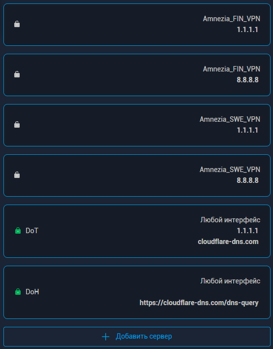

# Susanin.Keenetic

[](src)
[](README.md)
[](README.md)
[](README.md)
[](LICENSE)
[](https://github.com/R17a/Susanin.Keenetic/releases)

[](https://pay.cloudtips.ru/p/dcbf5f2e)
[](https://www.donationalerts.com/r/dmitriy_r17a)
[](https://t.me/Susanin_Keenetic)

> Проект сделан по статье на
> [Habr](https://habr.com/ru/articles/1076620/) и проекту
> [Fiark/susanin](https://github.com/Fiark/susanin) (адаптивная
> VPN-маршрутизация для MikroTik RouterOS), перенесён на роутеры
> Keenetic/Entware.

Простыми словами: программа смотрит, какие соединения «не работают» из-за
блокировок, пробует их через VPN, запоминает рабочие и дальше держит их в VPN.
Если VPN недоступен — всё идёт напрямую. Есть и простой список доменов, которые
должны идти через VPN **всегда** (без ручных списков IP — только имена, как в
Keenetic).

> **Статус: активная разработка, идёт обкатка на реальных роутерах.**
> Проверено на Keenetic Viva (MT7621, MIPS), KeeneticOS 5.1.4, Entware,
> туннель WireGuard/AmneziaWG `nwg0`. Работает на старых правилах
> iptables + ipset (nftables на этом ядре нет).

## Что делает

- наблюдает за поведением соединений (conntrack), а не за содержимым;
- по «тихим» признакам блокировок (TCP SYN без ответа, QUIC/UDP без reply,
  TCP-stall, late-stall) отправляет IP на проверку через VPN;
- подтверждает рабочие направления (кэш `ok`) и запоминает их **постоянно**
  (`ok_ttl=0`, переживает перезагрузки; снимает сам, если маршрут через VPN
  перестал отвечать);
- TCP и UDP/QUIC учит раздельно;
- список доменов «всегда через VPN» (`vpn_always.txt`): эти направления всегда
  идут в туннель; поддерживаются wildcard-зоны `*.example.com`;
- список «всегда напрямую» (`vpn_never.txt`, never VPN): домен / IPv4 / CIDR и
  wildcard `*.example.com` — такие направления никогда не уходят в VPN
  (например, `forum.keenetic.ru` или собственный прокси на RU-сервере);
- если сайт ответил по основному каналу, он **не** заворачивается в VPN
  (кандидатами становятся только направления без ответа);
- fail-open: при недоступности туннеля — прямой доступ (DIRECT);
- автоматически чинит правила, если их снёс NDM (Web-UI change) — reconcile;
- может маршрутизировать и клиентов **OpenConnect-сервера** на этом же роутере
  (интерфейс `oc0`): установщик находит сервер и предлагает добавить его в
  маршрутизацию;
- работает как демон под Entware (`/opt`), управление — только CLI/SSH.

Не является VPN-клиентом: туннель (WireGuard/AmneziaWG «Дополнительное
подключение») должен уже работать. IPv6 в v1 не поддерживается.

## Как это устроено (кратко)

- **Смотрим на соединения, а не на содержимое.** Программа читает
  `/proc/net/nf_conntrack` — там видно состояние TCP, сколько пакетов и байт
  ушло и пришло, метки.
- **Правила фильтрации.** Своя цепочка `SUSANIN` в mangle PREROUTING (после
  правил Keenetic). Нужные адреса помечаются через `CONNMARK`/`MARK` и уходят
  в отдельную таблицу маршрутизации (по умолчанию `100`; номер должен быть
  маленьким — busybox `ip` не понимает большие). Адреса хранятся в наборах
  ipset `susanin_{test,ok}_{tcp,udp}`.
- **Таймеры.** Проверки идут по расписанию: FAST 1 с, SOFT 2 с, JUDGE 1 с,
  HEALTH 5 с. «Зависшие» соединения удаляются из conntrack, чтобы клиент
  подключился заново — уже через VPN. Пороги взяты из проекта Susanin.MikroTik.

### Наборы адресов (ipset)

Программа хранит адреса в наборах ipset. Команда `status` показывает, сколько
адресов в каждом наборе (блок «ipset sizes»):

| Набор | Что содержит |
|---|---|
| `susanin_ok_tcp` / `susanin_ok_udp` | подтверждённые адреса — идут через VPN (TCP и UDP/QUIC учатся отдельно) |
| `susanin_test_tcp` / `susanin_test_udp` | адреса, которые сейчас проверяются через VPN |
| `susanin_ok_net` | диапазоны (CIDR) из `vpn_always.txt` |
| `susanin_never` | адреса «всегда напрямую» из `vpn_never.txt` |

Пример: `susanin_ok_tcp = 2682` — столько адресов подтверждено и идёт через VPN.

## Требования

- Keenetic с установленным **Entware**;
- пакеты Entware: `ipset`, `conntrack`, busybox, `iptables` (legacy);
- работающий VPN-туннель (WireGuard/AmneziaWG) — его интерфейс будет egress;
- LAN-интерфейсы (обычно `br0`, `br1`);
- в Keenetic **выключена «Маршрутизация DNS»** (доменные маршруты, которые
  уводят домены в туннель) — иначе Keenetic и Susanin мешают друг другу;

  

- настроен **шифрованный DNS (DoH/DoT)** — на роутере или на клиентах: иначе
  провайдер может подменить ответы DNS, и клиент не получит настоящий адрес
  сайта даже при рабочем VPN (частая причина «YouTube/Claude не открывается»);

  

- root-доступ по SSH.

## Дистрибутив

Готовые сборки — в разделе **Releases** (по архитектурам, вместе с `SHA256SUMS`):
- `susanin-keenetic-deploy-<arch>.tar.gz`, где arch = `mipsel`, `mips`,
  `aarch64`, `armv7`, `x86_64`. Внутри всё для установки: `susanin-agent`,
  `datapath.sh`, `susanin.sh`, `update.sh`, `uninstall.sh`, `install.sh`,
  конфиг, `vpn_always.txt`, `vpn_never.txt`.

**Проверено на живом роутере:** Keenetic Viva / KeeneticOS 5.1.4–5.1.5 /
Entware, архитектура **mipsel**. Остальные архитектуры собраны и приложены к
релизам, но на живом железе не проверялись — если что-то не работает, напишите
в Issues.

**Собрать без локального компилятора** — через готовый образ на GitHub:

```sh
docker pull ghcr.io/r17a/susanin.keenetic:latest
docker run --rm -v "$PWD/build:/out" ghcr.io/r17a/susanin.keenetic:latest \
  sh -c 'cp /src/susanin-agent /out/susanin-agent.mipsel'
```

Образ: https://github.com/users/R17a/packages/container/package/susanin.keenetic

Для других архитектур используйте мультиархитектурную сборку
`sh tools/wsl-build.sh mipsel mips aarch64 armv7 x86_64` (см. «Сборка»).

## Домены, которые всегда через VPN

Для заведомо заблокированных сервисов (например, Claude/Anthropic) обучение не
нужно — их можно указать вручную. Список задаётся файлом
`/opt/susanin/etc/vpn_always.txt` (по одному домену, IP или диапазону CIDR на
строку).

Программа сама замечает изменения (перезапуск не нужен): она находит адреса
доменов и добавляет их в наборы `susanin_ok_{tcp,udp}` — все TCP/UDP-соединения
с этими адресами сразу идут через VPN. Подробности:

- путь по умолчанию — `/opt/susanin/etc/vpn_always.txt` (поле
  `vpn_always_file` в конфиге; если файла нет — функция выключена);
- файл перечитывается каждые `vpn_always_interval` (по умолчанию `300s`),
  адреса обновляются; правки применяются сразу, без перезапуска;
- убрали домен из файла — его адреса снимутся при следующем обновлении (то, что
  уже подтверждено обучением, останется в обычном кэше);
- поддомен указывается отдельной строкой (`sub.example.com`);
- **`*.example.com`** — домен и поддомены: берутся адреса самого домена и
  «пробного» поддомена. Если у поддомена свой отдельный адрес — его найдёт
  обучение (или добавьте `sub.example.com` отдельной строкой);
- если домен есть и в `vpn_always.txt`, и в `vpn_never.txt` (или зоны
  пересекаются, например `*.keenetic.ru` и `forum.keenetic.ru`), приоритет у
  «напрямую»; в лог пишется предупреждение;
- поддерживается только IPv4 (A-записи); диапазоны (`a.b.c.d/n`) добавляются как
  есть; DNS-сервер берётся из `/etc/resolv.conf` или из поля `vpn_always_dns`;
- готовый список идёт в комплекте (`vpn_always.txt`) и ставится в
  `/opt/susanin/etc/vpn_always.txt` **только если файла ещё нет** — при
  установке и обновлении ваш список не перезаписывается.
  Проверить: `sh /opt/susanin/tools/susanin.sh status` покажет домены.

## Домены, которые всегда НАПРЯМУЮ (never VPN)

Обратный список — то, что **никогда** не должно идти через VPN (например, свой
прокси на сервере в РФ). Файл `/opt/susanin/etc/vpn_never.txt` (домен, IP или
CIDR), по умолчанию пустой. Поддерживается **`*.example.com`** — домен и все
поддомены (как в `vpn_always.txt`). Если домен есть в обоих списках — приоритет
у «напрямую», в лог пишется предупреждение.

Программа находит адреса доменов и кладёт их в набор `susanin_never`. В цепочке
`SUSANIN` для этого набора стоит `RETURN` **до** правил пометки, поэтому такие
адреса не попадают в `ok`/`test` и всегда идут напрямую. Если адрес ошибочно
попал в VPN-кэш — уберите его командой
`sh /opt/susanin/tools/susanin.sh forget <ip>`.

## OpenConnect VPN на том же роутере

Если на роутере работает **OpenConnect-сервер** (ocserv), установщик сам находит
его интерфейс (`oc0`) и спрашивает:

```
OpenConnect server detected (oc0). Add it to Susanin routing? [y/N]
```

Ответьте `y` (или `yes`). При запуске с `--yes` вопрос не задаётся. Что делает
установщик при согласии:

- добавляет интерфейс `oc0` в `lan_interfaces`;
- добавляет подсеть клиентов OpenConnect (например, `172.16.5.0/24`) в
  `lan_subnets` (значение берётся из `ipv4-network` в
  `/var/run/ocserv/ocserv.conf` или из адреса интерфейса);
- после этого трафик клиентов (телефон/ноутбук через OpenConnect)
  обрабатывается так же, как трафик LAN: заблокированное идёт через VPN,
  остальное — напрямую; отдельные правила NAT не нужны.

## Важно: «Приоритеты подключений» Keenetic и Susanin

Keenetic умеет сам направлять устройства и сегменты в VPN (Web →
**«Приоритеты подключений»**). Это **отдельный механизм**: его правила идут с
приоритетом 100–107, а правила Susanin — 2000/2001. Поэтому для клиента,
привязанного к политике Keenetic, весь трафик идёт по решению Keenetic (в VPN
или напрямую — зависит от политики), а списки и обучение Susanin на него
**не действуют**.

Простое правило: **у каждого клиента должен быть один «решающий» механизм.**

- Хотите, чтобы решал Susanin (что через VPN, что напрямую) — у клиента или
  сегмента **не должно быть назначено никакой политики** (оставьте системную
  «по умолчанию»). Это про **любую** политику: названия задаёте вы сами, и
  любая назначенная политика перекрывает Susanin. Например, при политике
  «только напрямую» заблокированный сайт не откроется, и Susanin не сможет
  завернуть его в VPN.
- Хотите «всё и всегда через VPN» — можно назначить политику Keenetic, но тогда
  списки и обучение Susanin для этого клиента не работают.
- Смешивать оба для одного клиента нельзя.

Проверить привязки:

```sh
ndmc -c "show running-config" | grep -i "ip policy"
```
(или Web → «Приоритеты подключений»).

Как понять по conntrack, кто управляет клиентом:
- `mark=2684xxxxx` (`0xffffaXX`) — клиент под политикой Keenetic, Susanin его не
  обрабатывает;
- `mark=0` или `mark=536870912` (`0x20000000`) — работает Susanin (напрямую или
  через VPN).

## Установка / обновление / удаление

Сначала поставьте сертификаты — иначе `wget` не скачает релиз по HTTPS:

```sh
opkg update && opkg install ca-certificates
```

Установка **одной строкой**: скачается архив под вашу архитектуру,
автоматически определятся LAN и VPN, затем спросит подтверждение. На Entware
`curl` обычно нет — используйте `wget`:

```sh
wget -qO- https://raw.githubusercontent.com/R17a/Susanin.Keenetic/main/install.sh | sh
```

Либо поставьте curl и используйте его:
```sh
opkg install curl
curl -fsSL https://raw.githubusercontent.com/R17a/Susanin.Keenetic/main/install.sh | sh
```

Архитектура определяется сама (по `uname -m`). Дополнительные флаги:
`--arch mipsel|mips|aarch64|armv7|x86_64` (задать вручную),
`--version latest|vX.Y.Z`, `--egress <if>`, `--lan <if,if>`,
`--subnets <cidr,cidr>`, `--yes` (без подтверждений), `--force`
(перезаписать `susanin.conf`), `--no-start`, `--prefix <dir>`.

Подтверждения (`[y/N]`) можно либо отвечать вручную (`y` или `yes`), либо
заранее передать `--yes` (`-y`) и не отвечать ни на что.

Установка из распакованного архива (без интернета):
```sh
sh install.sh --yes
```

Ваши `/opt/susanin/etc/susanin.conf` и `vpn_always.txt` при установке и
обновлении **не перезаписываются**.

Если на роутере есть **OpenConnect-сервер (ocserv)** и его интерфейс (`oc0`) не
в маршрутизации, установщик спросит (по-английски), добавить ли его:
`OpenConnect server detected (oc0). Add it to Susanin routing? [y/N]`.
Ответьте `y`; при `--yes` добавится сам.


**Обновление** (конфиг и состояние сохраняются):

```sh
sh /opt/susanin/tools/susanin.sh update            # до последнего релиза
sh /opt/susanin/tools/susanin.sh update v0.3.3     # конкретная версия
```


**Удаление**:

```sh
sh /opt/susanin/tools/susanin.sh uninstall          # остановить и снять правила/автозапуск, конфиг и состояние оставить
sh /opt/susanin/tools/susanin.sh uninstall --purge  # удалить /opt/susanin полностью
```

В релизах публикуются архивы `susanin-keenetic-deploy-<arch>.tar.gz`
(mipsel/mips/aarch64/armv7/x86_64) и `SHA256SUMS`.

Если нужно настроить правила вручную:
```sh
sh /opt/susanin/tools/susanin.sh install    # datapath up + setup
# либо явно:
/opt/susanin/bin/susanin-agent setup --egress nwg0 --lan br0,br1 --table 100
```

**Управление демоном:**

| Действие | Команда |
|---|---|
| Запуск | `sh /opt/susanin/tools/susanin.sh start` |
| Остановка | `sh /opt/susanin/tools/susanin.sh stop` |
| Перезапуск | `sh /opt/susanin/tools/susanin.sh restart` |
| Состояние | `sh /opt/susanin/tools/susanin.sh status` |
| Лог | `sh /opt/susanin/tools/susanin.sh log` |
| Снять правила | `sh /opt/susanin/tools/susanin.sh down` |
| Убрать IP из кэша | `sh /opt/susanin/tools/susanin.sh forget <ip>` |
| Обновление | `sh /opt/susanin/tools/susanin.sh update` |
| Удаление | `sh /opt/susanin/tools/susanin.sh uninstall [--purge]` |
| Добавить IP в VPN вручную | `sh /opt/susanin/tools/susanin.sh add <ip> tcp test` |

## CLI

```
susanin-agent version
susanin-agent discover
susanin-agent setup [--egress <if>] [--lan <if,...>] [--table <n>]
susanin-agent status
susanin-agent apply [--dry-run]
susanin-agent ct-scan
susanin-agent datapath {up|down|status|flush|add|del}
susanin-agent run
susanin-agent install | uninstall
```

## Сборка

Кросс-компиляция в MIPS (mipsel, static) — через WSL или Docker:

```sh
# WSL (Debian/Ubuntu):
sudo apt-get install -y gcc-mipsel-linux-gnu make file
sh tools/wsl-build.sh            # -> build/susanin-agent.mipsel

# Docker:
docker build -f Dockerfile.cross -t susanin-build .
```

## Конфиг (важные поля)

`/opt/susanin/etc/susanin.conf`:

| Поле | Назначение | По умолчанию |
|---|---|---|
| `egress_interface` | VPN-интерфейс(ы); несколько через запятую = фейловер | `nwg0` |
| `egress_address` | адрес(а) туннеля, по порядку с `egress_interface` | `10.8.1.1` |
| `lan_interfaces` / `lan_subnets` | LAN, трафик которых анализируем | `br0,br1` |
| `routing_table` | номер таблицы (должен быть малым) | `100` |
| `ok_ttl` | срок жизни подтверждённых адресов; `0` = бессрочно | `0` |
| `fast_syn_min_op` | сколько SYN без ответа нужно для срабатывания | `2` (`1` = быстрее) |
| `learn_exclude_ports` | порты, где отключено быстрое обучение (сетевой шум) | `22,23,53,135,137,138,139,445,554,…` |
| `health_probe` | адреса для проверки туннеля | `1.1.1.1,8.8.8.8` |
| `vpn_always_file` | файл «всегда через VPN» (нет файла = выключено) | `/opt/susanin/etc/vpn_always.txt` |
| `vpn_always_interval` | как часто перечитывать и обновлять список | `300s` |
| `vpn_always_dns` | DNS-сервер для списка (пусто = из resolv.conf) | (пусто) |
| `vpn_never_file` | файл «всегда напрямую» (нет файла = выключено) | `/opt/susanin/etc/vpn_never.txt` |
| `vpn_never_interval` | как часто перечитывать и обновлять список | `300s` |
| `ok_max_entries` | предел числа записей кэша на протокол (0 = без предела) | `4096` |
| `disk_mode` | `normal` (лог/состояние/бэкапы) или `soft` (минимум записей) | `normal` |
| `soft_state_interval` | как часто сохранять состояние в `soft` (0 = никогда) | `12h` |

Про `learn_exclude_ports`: для этих портов отключено только **быстрое**
обучение — детект «одиночный запрос без ответа» (так выглядит сетевой шум и
сканирования), поэтому они не пополняют кэш. Потоки с ответами, которые затем
тормозят, по-прежнему обучаются. На маршрутизацию это не влияет: обрабатываются
все порты, а адреса из `vpn_always.txt` / `vpn_never.txt` и уже выученные идут
как обычно. Если заблокированный сервис работает на таком порту — добавьте его
домен/IP в `vpn_always.txt` (список не зависит от порта) или уберите порт из
`learn_exclude_ports`.

### Несколько VPN-подключений (фейловер)

Если указать несколько интерфейсов (например, `egress_interface=nwg0,nwg1`,
адреса — по порядку), программа проверяет активный туннель и при обрыве
переключает VPN-таблицу на следующий живой, разрывая соединения с VPN-меткой —
чтобы клиент подключился через живой туннель. Когда живых не осталось — всё
идёт напрямую. Источник для проверок берётся из соответствующего
`egress_address`.

### Режим `disk_mode` (сколько писать на носитель)

- `normal` — обычный режим (по умолчанию при установке на USB/флешку): ведётся
  лог-файл, состояние сохраняется раз в 5 минут, делаются бэкапы.
- `soft` — режим экономии (установщик включает его при установке во внутреннюю
  память роутера): лог-файл не ведётся, бэкапы не создаются, а состояние
  сохраняется редко — раз в `soft_state_interval` (по умолчанию 12 часов).

## Известные ограничения v1

- только IPv4;
- первое открытие «нового» адреса чуть медленнее (обучение по факту);
- busybox-`ip`: номер таблицы должен быть малым, `ip rule` — через `lookup`;
- при пересборке правил Keenetic (любое изменение в Web) программа сама
  восстанавливает свои правила в течение ~15 секунд;
- клиент или сегмент, привязанный к **любой** политике Keenetic («Приоритеты
  подключений»), обходит Susanin — для него списки и обучение не работают
  (см. раздел «Важно: «Приоритеты подключений» Keenetic и Susanin»).

## Документы

- [CHANGELOG.md](CHANGELOG.md) — что нового по версиям;
- [DEPLOY.md](DEPLOY.md) — установка/обновление/удаление на роутере;
- `tools/susanin.sh`, `tools/datapath.sh` — управление демоном и правилами.

## Поддержать проект

Проект развивается на энтузиазме. Если он оказался полезным — можно поддержать
разработку:

<p align="center">
  <a href="https://www.donationalerts.com/r/dmitriy_r17a">
    
  </a>
  &nbsp;
  <a href="https://pay.cloudtips.ru/p/dcbf5f2e">
    
  </a>
</p>

## Дисклеймер

Проект не связан и не аффилирован с Keenetic, Amnezia, WireGuard, MikroTik или
авторами упомянутых сторонних проектов. Используйте на свой страх и риск —
сделайте резервную копию конфигурации роутера.

## Лицензия

MIT — см. [LICENSE](LICENSE).
