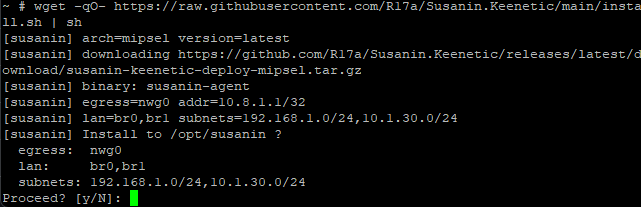
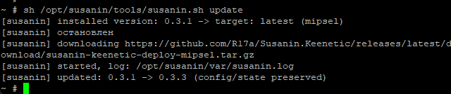

# Susanin.Keenetic

> Проект разработан на основе статьи на
> [Habr](https://habr.com/ru/articles/1076620/) и проекта
> [Fiark/susanin](https://github.com/Fiark/susanin) (адаптивная
> VPN-маршрутизация для MikroTik RouterOS), портирован на роутеры
> Keenetic/Entware.

Адаптивная маршрутизация «как в Susanin (MikroTik)» для роутеров **Keenetic**
с **Entware**. Автоматически обнаруживает заблокированные направления,
пробует их через VPN-туннель, запоминает рабочие пути и возвращается в
прямой доступ (fail-open), если туннель недоступен. Дополнительно поддерживает
простой список доменов, которые должны идти через VPN **всегда**
(без ручных списков IP — только имена, как в Keenetic).

> **Статус: активная разработка / полевое тестирование.**
> Проверено на Keenetic Viva (MT7621, MIPS), KeeneticOS 5.1.4, Entware,
> WireGuard/AmneziaWG-туннель `nwg0`. Основная среда — legacy iptables + ipset
> (nftables на этом ядре нет).

## Что делает

- наблюдает за поведением соединений (conntrack), а не за содержимым;
- по «тихим» признакам блокировок (TCP SYN без ответа, QUIC/UDP без reply,
  TCP-stall, late-stall) отправляет IP на проверку через VPN;
- подтверждает рабочие направления (кэш `ok`) и запоминает их **постоянно**
  (`ok_ttl=0`, переживает перезагрузки; снимает сам, если маршрут через VPN
  перестал отвечать);
- TCP и UDP/QUIC учит раздельно;
- список доменов «всегда через VPN» (`vpn_always.txt`): резолвит A-записи и
  пинит их IP в ok-наборы, изменения файла подхватывает на лету;
- fail-open: при недоступности туннеля — прямой доступ (DIRECT);
- автоматически чинит правила, если их снёс NDM (Web-UI change) — reconcile;
- может маршрутизировать и клиентов **OpenConnect-сервера** на этом же роутере
  (интерфейс `oc0`): установщик находит сервер и предлагает добавить его в
  маршрутизацию;
- работает как демон под Entware (`/opt`), управление — только CLI/SSH.

Не является VPN-клиентом: туннель (WireGuard/AmneziaWG «Дополнительное
подключение») должен уже работать. IPv6 в v1 не поддерживается.

## Как это устроено (кратко)

- **Сенсор**: чтение `/proc/net/nf_conntrack` — поля, аналогичные
  `/ip firewall connection` RouterOS (tcp-state, orig/reply packets/bytes, mark).
- **Дата-плейн**: собственная цепочка `SUSANIN` в конце mangle PREROUTING
  (после правил NDM), mark через `CONNMARK`/`MARK`, отдельная routing table
  (например `100`, малый номер — busybox `ip` не принимает большие),
  ipset-наборы `susanin_{test,ok}_{tcp,udp}`.
- **Логика**: демон с таймерами FAST 1с / SOFT 2с / JUDGE 1с / HEALTH 5с;
  удаляет «зависшие» соединения из conntrack, чтобы повтор клиента ушёл через
  VPN. Пороги наследованы из проекта Susanin.MikroTik.

## Требования

- KeeneticOS с установленным **Entware**;
- пакеты Entware: `ipset`, `conntrack`, busybox, `iptables` (legacy);
- работающий VPN/туннель (WireGuard/AmneziaWG) — интерфейс egress;
- LAN-интерфейсы (обычно `br0`, `br1`);
- root-доступ по SSH.

## Дистрибутив (для тестеров)

Готовые сборки — в разделе **Releases** (по архитектурам, +`SHA256SUMS`):
- `susanin-keenetic-deploy-<arch>.tar.gz`, где arch = `mipsel`, `mips`,
  `aarch64`, `armv7`, `x86_64` — комплект для установки (`susanin-agent`,
  `datapath.sh`, `susanin.sh`, `update.sh`, `uninstall.sh`, `install.sh`,
  конфиг, `vpn_always.txt`).

**Проверено на реальном железе:** Keenetic Viva / KeeneticOS 5.1.4–5.1.5 /
Entware, архитектура **mipsel**. Остальные архитектуры собираются в CI, но на
живом железе не тестировались — если что-то не работает, сообщите в Issues.

**Собрать бинарь без локального тулчейна** — через кросс-образ на GitHub Packages:

```sh
docker pull ghcr.io/r17a/susanin.keenetic:latest
docker run --rm -v "$PWD/build:/out" ghcr.io/r17a/susanin.keenetic:latest \
  sh -c 'cp /src/susanin-agent /out/susanin-agent.mipsel'
```

Пакет: https://github.com/users/R17a/packages/container/package/susanin.keenetic

Для других архитектур используйте мультиархитектурную сборку
`sh tools/wsl-build.sh mipsel mips aarch64 armv7 x86_64` (см. «Сборка»).

## Домены, которые всегда через VPN

Адаптивное обучение не требуется для заведомо заблокированных сервисов
(например, Claude/Anthropic в РФ). Положите в роутер файл со списком доменов:

```sh
cat > /opt/susanin/etc/vpn_always.txt <<'EOF'
# по одному домену / IPv4 / CIDR на строку; '#' — комментарии
anthropic.com
claude.ai
104.16.0.0/13
EOF
```

Демон заметит файл сам (без перезапуска), отресолвит A-записи доменов и
добавит их IP в ipset-наборы `susanin_ok_{tcp,udp}` — любые TCP/UDP
соединения с этими IP будут сразу уходить в VPN-таблицу. Поведение:

- имя файла по умолчанию — `/opt/susanin/etc/vpn_always.txt`
  (поле `vpn_always_file` в конфиге; нет файла = функция выключена);
- файл перечитывается каждые `vpn_always_interval` (по умолчанию `300s`),
  IP обновляются; правки файла подхватываются сразу, без рестарта;
- убрали домен из файла — его «свои» IP будут распинены при следующем
  обновлении (уже подтверждённые обучением останутся как обычный кэш `ok`);
- полное имя `sub.example.com` указывается отдельной строкой;
- только IPv4 (A-записи); CIDR-строки (`a.b.c.d/n`) пинятся как есть;
  резолвер — из `/etc/resolv.conf` или поле `vpn_always_dns`;
- готовый список поставляется с дистрибутивом (`vpn_always.txt`) и ставится в
  `/opt/susanin/etc/vpn_always.txt` **только если файла ещё нет** — при install
  и update существующий список не перезаписывается.
  Проверка: `sh /opt/susanin/tools/susanin.sh status` покажет домены.

## Установка / обновление / удаление

Перед установкой на Entware поставьте сертификаты (иначе `wget` не пройдёт по
HTTPS при скачивании релиза):

```sh
opkg update && opkg install ca-certificates
```

Установка **одной строкой**: скачивается архив под вашу архитектуру,
автоматически определяются LAN/VPN-интерфейсы, затем запрашивается
подтверждение. На Entware `curl` обычно отсутствует — используйте `wget`:

```sh
wget -qO- https://raw.githubusercontent.com/R17a/Susanin.Keenetic/main/install.sh | sh
```

Либо поставьте curl и используйте его:
```sh
opkg install curl
curl -fsSL https://raw.githubusercontent.com/R17a/Susanin.Keenetic/main/install.sh | sh
```

Архитектура определяется автоматически по `uname -m`. Дополнительные флаги:
`--arch mipsel|mips|aarch64|armv7|x86_64` (override),
`--version latest|vX.Y.Z`, `--egress <if>`, `--lan <if,if>`,
`--subnets <cidr,cidr>`, `--yes` (без подтверждения), `--force`
(перезаписать `susanin.conf`), `--no-start`, `--prefix <dir>`.

Подтверждения установщика (`[y/N]`) можно давать двумя способами:
- **интерактивно** — ответить `y` (или `yes`);
- **заранее** — передать флаг `--yes` (или `-y`) и не отвечать ни на один вопрос.

Офлайн-установка из распакованного архива:
```sh
sh install.sh --yes
```

Существующие `/opt/susanin/etc/susanin.conf` и
`/opt/susanin/etc/vpn_always.txt` при install/update **не перезаписываются**.

Если на роутере поднят **OpenConnect-сервер (ocserv)** и его интерфейс
(`oc0`) не входит в маршрутизацию, установщик спросит по-английски, добавить
ли его в Susanin (`OpenConnect server detected (oc0). Add it to Susanin
routing? [y/N]`). Достаточно ответить `y` (или `yes`); при `--yes` добавление
происходит автоматически, без вопроса.



**Обновление** (конфиг `susanin.conf` и состояние сохраняются):

```sh
sh /opt/susanin/tools/susanin.sh update            # до последнего релиза
sh /opt/susanin/tools/susanin.sh update v0.3.3     # конкретная версия
```



**Удаление**:

```sh
sh /opt/susanin/tools/susanin.sh uninstall          # стоп + снять datapath/init, конфиг и state оставить
sh /opt/susanin/tools/susanin.sh uninstall --purge  # удалить /opt/susanin полностью
```

В релизах публикуются архивы `susanin-keenetic-deploy-<arch>.tar.gz`
(mipsel/mips/aarch64/armv7/x86_64) и `SHA256SUMS`.

При необходимости (ручная настройка data plane):
```sh
sh /opt/susanin/tools/susanin.sh install    # datapath up + setup
# либо явно:
/opt/susanin/bin/susanin-agent setup --egress nwg0 --lan br0,br1 --table 100
```

**Управление демоном:**

| Действие | Команда |
|---|---|
| Запуск | `sh /opt/susanin/tools/susanin.sh start` |
| Остановка (graceful) | `sh /opt/susanin/tools/susanin.sh stop` |
| Перезапуск | `sh /opt/susanin/tools/susanin.sh restart` |
| Состояние | `sh /opt/susanin/tools/susanin.sh status` |
| Лог | `sh /opt/susanin/tools/susanin.sh log` |
| Снять правила | `sh /opt/susanin/tools/susanin.sh down` |
| Обновление | `sh /opt/susanin/tools/susanin.sh update` |
| Удаление | `sh /opt/susanin/tools/susanin.sh uninstall [--purge]` |
| IP вручную в VPN | `sh /opt/susanin/tools/susanin.sh add <ip> tcp test` |

## CLI

```
susanin-agent version
susanin-agent discover
susanin-agent setup [--egress <if>] [--lan <if,...>] [--table <n>]
susanin-agent status
susanin-agent apply [--dry-run]
susanin-agent ct-scan
susanin-agent datapath {up|down|status|flush|add|del}
susanin-agent run
susanin-agent install | uninstall
```

## Сборка

Кросс-компиляция в MIPS (mipsel, static) — через WSL или Docker:

```sh
# WSL (Debian/Ubuntu):
sudo apt-get install -y gcc-mipsel-linux-gnu make file
sh tools/wsl-build.sh            # -> build/susanin-agent.mipsel

# Docker:
docker build -f Dockerfile.cross -t susanin-build .
```

## Конфиг (важные поля)

`/opt/susanin/etc/susanin.conf`:

| Поле | Назначение | По умолчанию |
|---|---|---|
| `egress_interface` | VPN-интерфейс | `nwg0` |
| `lan_interfaces` / `lan_subnets` | LAN для анализа | `br0,br1` |
| `routing_table` | номер таблицы (малый!) | `100` |
| `ok_ttl` | TTL подтверждённых IP; `0` = бесконечно | `0` |
| `fast_syn_min_op` | сколько SYN без ответа до детекта | `2` (`1` = быстрее) |
| `health_probe` | цели проверки туннеля | `1.1.1.1,8.8.8.8` |
| `vpn_always_file` | файл доменов «всегда через VPN» (нет файла = off) | `/opt/susanin/etc/vpn_always.txt` |
| `vpn_always_interval` | как часто перечитывать/резолвить список | `300s` |
| `vpn_always_dns` | резолвер для списка (пусто = из resolv.conf) | (пусто) |
| `ok_max_entries` | лимит записей ok-кэша на протокол (bounded GC; 0=off) | `4096` |

## Известные ограничения v1

- только IPv4;
- первое открытие «нового» IP чуть медленнее (реактивное обучение);
- busybox-`ip`: номер таблицы должен быть малым; `ip rule` через `lookup`;
- при пересборке netfilter NDM (любое изменение в Web) демон чинит правила
  сам в течение ~15 секунд.

## Документы

- [CHANGELOG.md](CHANGELOG.md) — история версий (что нового по релизам);
- [DEPLOY.md](DEPLOY.md) — установка/обновление/удаление на роутере;
- `tools/susanin.sh`, `tools/datapath.sh` — управление демоном и дата-плейном.

## Поддержать проект

Проект развивается на энтузиазме. Если он оказался полезным — можно поддержать
разработку:

- **DonationAlerts:** https://www.donationalerts.com/r/dmitriy_r17a
- **CloudTips:** https://pay.cloudtips.ru/p/dcbf5f2e

Также доступна кнопка **Sponsor** на странице репозитория.

## Дисклеймер

Проект не связан и не аффилирован с Keenetic, Amnezia, WireGuard, MikroTik или
авторами упомянутых сторонних проектов. Используйте на свой страх и риск —
сделайте резервную копию конфигурации роутера.

## Лицензия

MIT — см. [LICENSE](LICENSE).
